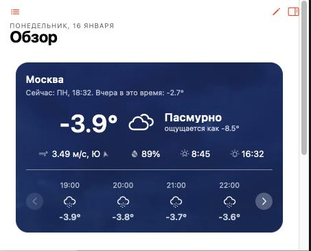
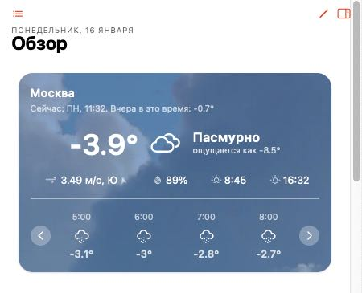

# Виджет погоды для openHAB 3

Данный виджет используется биндинг HTTP Binding.
Информацию для отображения получается с сайта open-meteo.com.

## Возможности

- смена иконки и фона при изменении текущего состояния погоды
    - чистое небо
    - пасмурно
    - снег
    - дождь
    - и другие...
- отображение почасового прогноза (иконка состояния погоды + температура)
    - по умолчанию отображается 24 часа, но возможно указать вплоть до 7 дней.

## Порядок установки

1. Внести нужные GPS координаты в файл openmeteo.things
2. Загрузить файл .things в папку CONF/things
3. Из UI зайти во вновь добавленную thing OpenMeteo, перейти в каналы
4. Добавить все items по нажатию "Add Equipment to Model"
5. Добавить виджет в меню "Инструменты разработчика" -> "Widgets"
6. Скопировать весь код из 'widget_OpenMeteoCard.yml' в поле создаваемего виджета с заменой того, что есть по умолчанию. Сохранить.
7. Добавить виджет на нужную страницу UI.